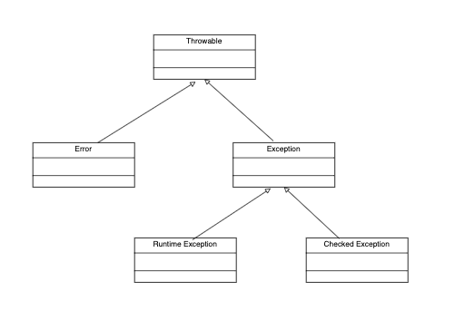

## Exceptions




1. Error
    - Error objects describe internal errors, JVM execution errors or resource exhaustion.
    - Ex: StackOverflowError, OutOfMemoryError, NoClassDefFoundError, InternalError
2. Runtime Exception 
   - Logic Error in the code needs fixing.
   - can also be used by devs to indicate a problem that needs correction ( IllegalArgumentException, IllegalStateException )
   - Ex: NullPointerException, ClassCastException, ArrayIndexOutOfBoundsException, NumberFormatException
3. Checked Exception
   - This type of exception needs to be handled by the devs.
   - This exception either needs to be handled with try/catch or add it to the function declaration 
   - Ex: CloneNotSupportedException, FileNotFoundException, SQLException, AWTException
```java
// handling Checked Exceptions
class Main(){
    
    // add throws exception to the method signature
   public static void doSomething() throws FileNotFoundException {
      throw new FileNotFoundException();
   }

   // surround with try/catch
   public static void doSomethingAgain(){
      try {
         throw new FileNotFoundException();
      } catch (FileNotFoundException e) {
         // handle error
      }
   }
    public static void main(String[] args){
    }
}
```


### try/catch
- If the code throws exception, it needs to be handled using try/catch statement.
- The catch statement catches the type of exception declared in the catch block.

```java

import java.io.IOException;

class Main{
    
public static void main(String[] args){
        try{
            // some code
        }catch(IOException ex) {
            // catch io exception
        }
}

}
```

- If there are multiple catch blocks the most specific exception needs to be at top and the generic at the last.
```java
import java.io.IOException;

class Main{
    
public static void main(String[] args){
        try{
            // some code
        }catch(FileNotFoundException ex) {
            // catch FileNotFoundException
        }catch(IOException ex) {
           // catch IOException
        }
        
}

}
```

### Finally Keyword
- Used in conjunction with try/catch
- finally block is guaranteed to run irrespective of whether the exception is thrown or not.
- It runs even if there is `return` or `break` statement.
- Only exception where finally block is not run is when `System.exit(0)` occurs before finally block.