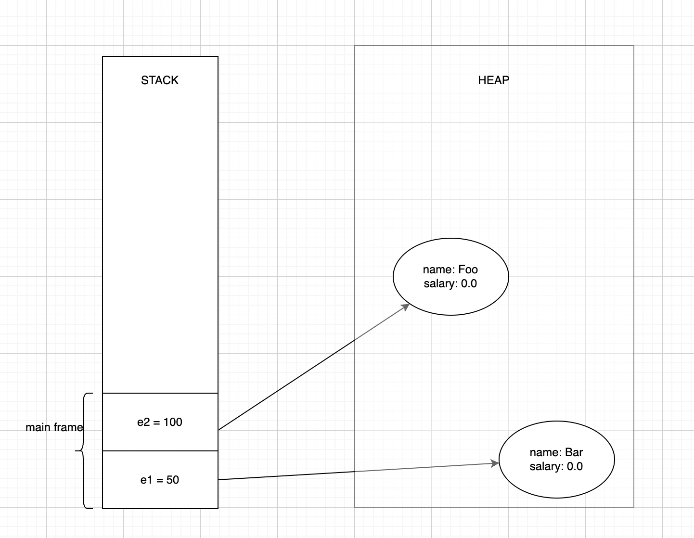
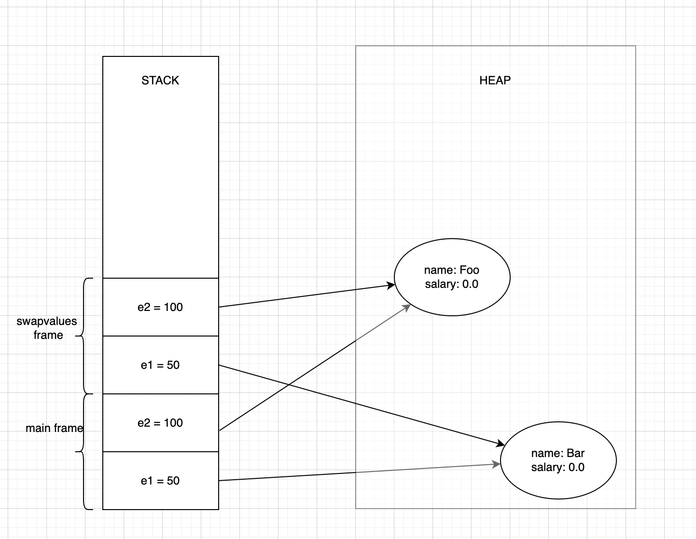
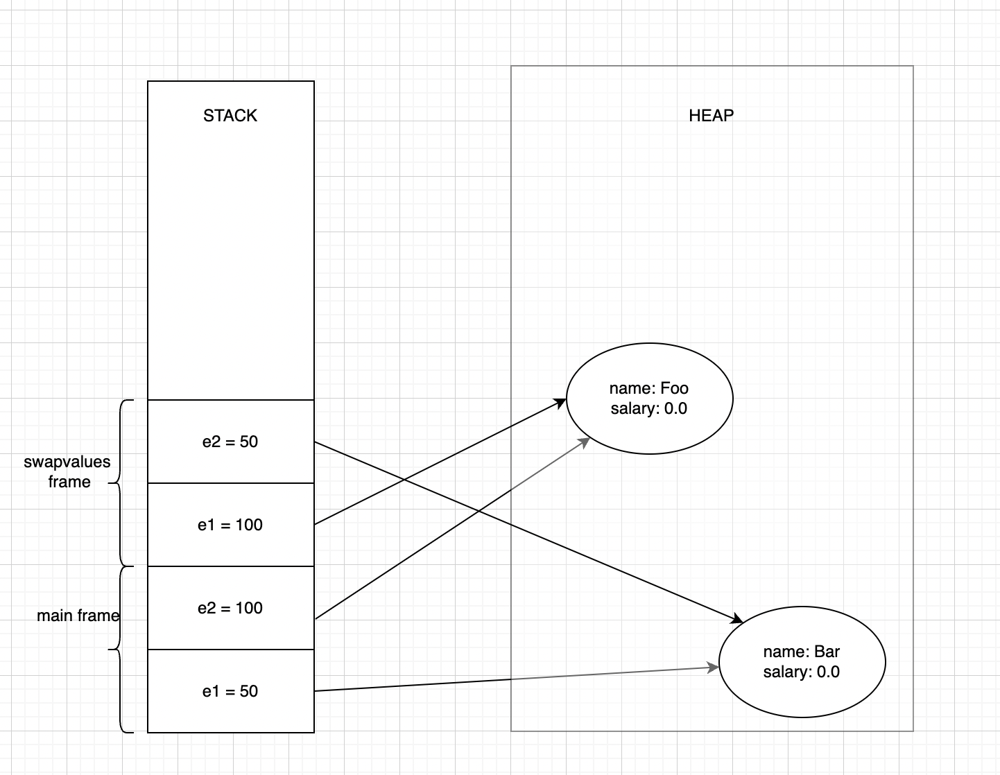
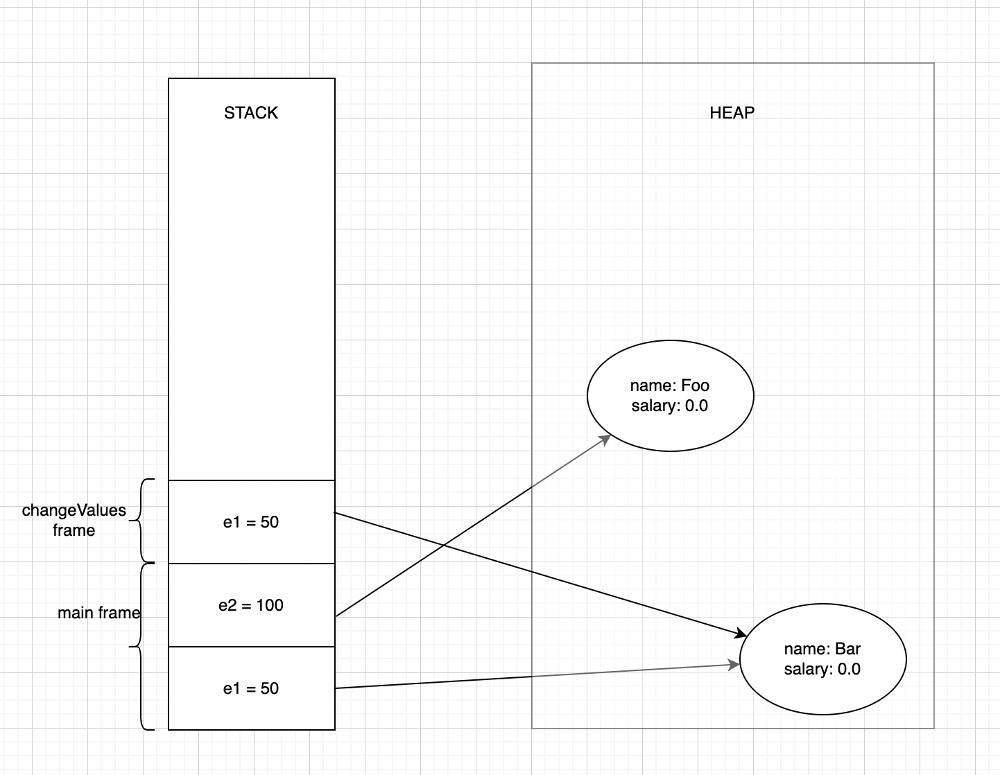
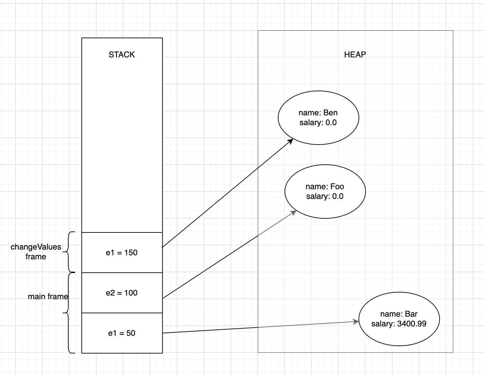
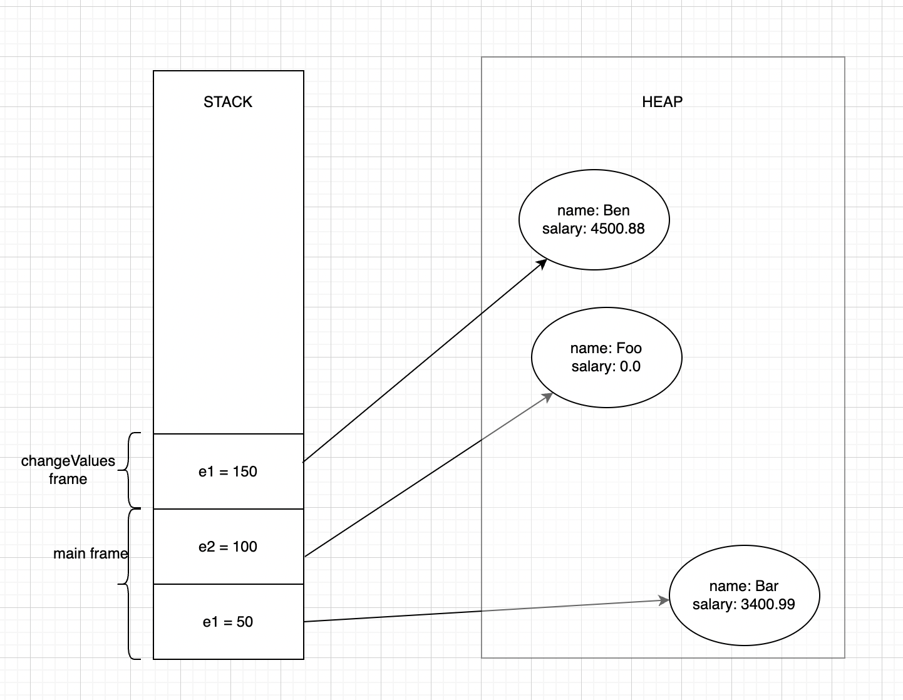
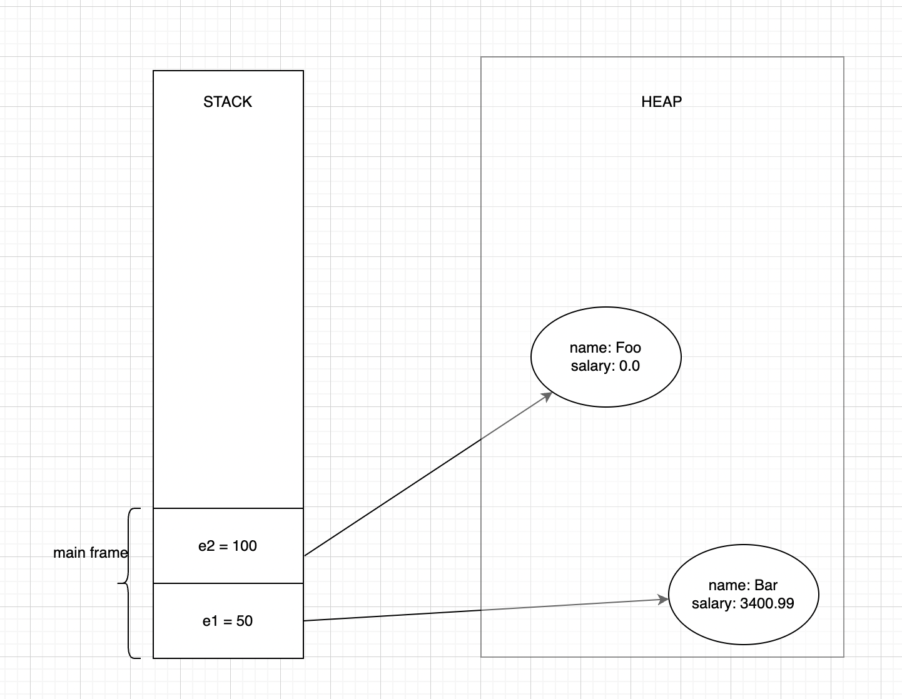

## 25. Java: call by value not call by reference

- Pass by value: The method parameter values are copied to another variable and then the copied object is passed to the method.
- Pass by reference: An alias or reference to the actual parameter is passed to the method. The method has access to the original parameter instead of copy.

Java is always pass by value. let’s look at a example:
```java

public class Employee{
	private String name;
	private double salary;
	
	Employee(String n){
		this.name = n;
	}
	
	public String getName(){
		return this.name;
	}
	
	public double getSalary(){
		return this.salary;
	}
	
	public void setSalary(double s){
		this.salary = s;
	}
	
	public String toString(){
		return "Employee: name: " + this.getName() + ", salary: "+ this.getSalary();
	}
	
}

```

```java
public class Main{
	
	public static void swapValues(Employee e1,Employee e2){
		Employee temp = e1;
		e1 = e2;
		e2 = temp;
	}
	
	public static void changeValue(Employee e1){
		e1.setSalary(3400.99);
		e1 = new Employee("Ben");
		e1.setSalary(4500.88);
	}
	
	public static void main(String[] args){
		Employee e1 = new Employee("Bar");
		Employee e2 = new Employee("Foo");
		
    System.out.println("e1 before swap: "+e1);
    System.out.println("e2 before swap: "+e2);
    
		swapValues(e1,e2);
		
		System.out.println("e1 after swap: "+e1);
		System.out.println("e2 after swap: "+e2);
		
		changeValue(e1);
		System.out.println("e1 after changing value: "+e1);
	}
	
}
```
when you run the Main class’s main method, below output can be seen.

```shell
e1 before swap: Employee: name: Bar, salary: 0.0
e2 before swap: Employee: name: Foo, salary: 0.0
e1 after swap: Employee: name: Bar, salary: 0.0
e2 after swap: Employee: name: Foo, salary: 0.0
e1 after changing value: Employee: name: Bar, salary: 3400.99
```

Explanation:

- when e1 and e2 are created using new operator, two memory address are created and the values are stored in that location. these memory address are stored in the variable e1 and e2.



- `swapValues`
    - when the swapValues method is called with e1 and e2, instead of passing the e1 and e2’s reference , another two new Employee variables e1, e2 ( local to swapValues) are created which also point to the same memory location.<br><br>
    <br><br>
    
    - when you are swapping the values , you are swapping the values of e1 and e2 which are local to the swapValues method. the e1 and e2 of main remain unchanged.<br><br>
    <br><br>
    - Thus after the execution of swap method, there is no change in the values of e1 and e1.<br><br>
    <br><br>

- `changeValue`
  - when the changeValue method is called with the Employee e1, new Employee variable e1 is created and passed to the changeValue. Both main’s e1 and changeValues e1 point to the same memory location.<br><br>
    <br><br>
  - now when `e1.setSalary(3400.99);` is called in the changeValue method, the object at location 50 , will be updated with the new salary value.<br><br>
    <br><br>
  - when e1 = new Employee("Ben"); is called new Employee object is created in the heap and its location is stored in e1. but the e1 on the main will remain unchanged.<br><br>
    <br><br>
  - now when any update methods are called on e1, the change will be reflected on the new object.<br><br>
    <br><br>
  - after the changeValue method completes its execution, the e1 on the main method will only have its salary updated.<br><br> 
    <br><br>

Thus from above Example we can see that java is pass by value not pass by reference.