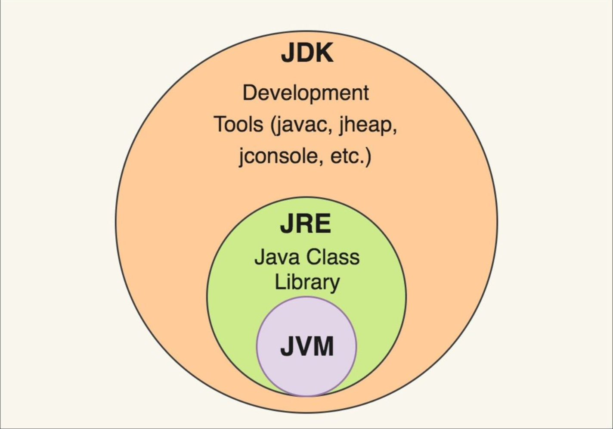

## JDK VS JRE VS JVM

JDK :

JDK stands for Java Development Kit. It consists of compiler,  JRE and development tools.

JDK also includes

- Java (a loader/interpreter),
- Javac (a compiler),
- Javadoc (a documentation generator),
- Jar (an archiver)

> JDKs are platform-dependent. Each platform requires a different JDK.
>

JRE:

The JRE stands for Java Runtime Environment. It is also known as Java RTE. JRE provides the runtime environment for the implementation of JVM.

All Java programs require JRE to run. Those who aren't Java programmers can install the JRE alone and run Java programs without installing the JDK.

JRE includes

- class library ( math, swing, util, lang, AWT, and runtime libraries )
- JVM

> The JRE is also platform-dependent, just like the JDK. Every platform requires a different JRE.
>

JVM:

A JVM stands for a Java Virtual Machine. The Java Virtual Machine (JVM) is a machine that converts Java bytecode into machine language.

Besides running java programs, it can also execute programs written in other languages (compiled into Java bytecode). Because it does not exist physically, the JVM is also known as a virtual machine.

The JVM is a component of the JRE (Java Run Environment). There is no way to download and install it separately. To install the JVM, you must first install the JRE. The software is compatible with a wide range of hardware and software platforms.

JVM has a built-in JIT compiler that converts Java source code into machine code. This results in faster performance compared to regular applications.

> JVMs are platform-independent. That means you don't need different JVMs for different platforms.
>

A compiler generates machine code for a specific system in several programming languages. The Java compiler, however, is the only one that generates code for Java virtual machines, or JVMs. JDK, JRE, and JVM are all dependent on each other. It is because each Operating System's (OS) condition differs.