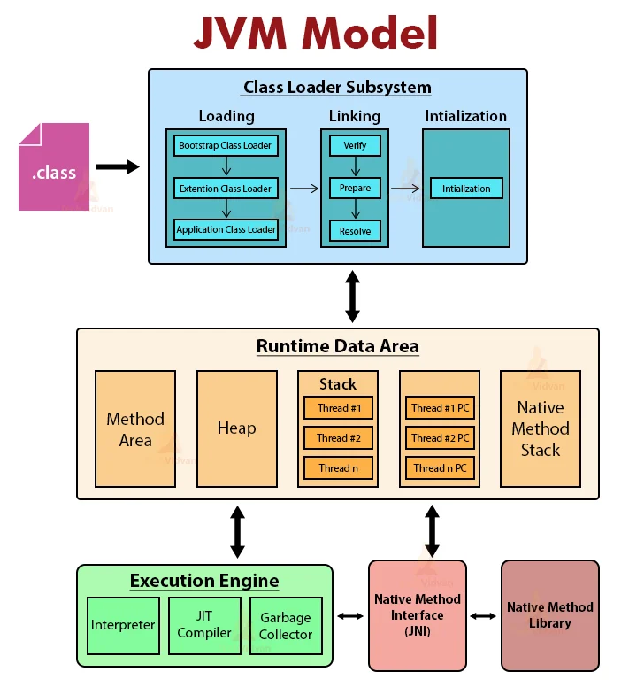

## 03. JVM ( Java Virtual Machine )



[Learn More](https://techvidvan.com/tutorials/java-virtual-machine/)

### ClassLoader:

loads classes in the memory. Three types:

- Bootstrap class loader - loads .jar files. superclass of extension class loader.
- Extension class loader - loads .jar file present in the directory. child of bootstrap and parent of system class loader
- System/Application class loader - loads class file from the class path

Functions of class loader:

- Initialization:
    - assigns all static variables with their specific values defined in the block of code and static block.
- Loading:
    - loads files from the secondary memory into the main memory ( RAM ) for execution.
    - the class loader reads the .class file, generates the corresponding binary data and saves it in the method area.
    - After loading the .class file, JVM creates an object of type Class to represent this file in the heap memory which can be used by programmers for getting class level information like the name of the class, parent name, methods, and variable information.
- Linking:
    - combines different files in the main program together. It performs verification, preparation, and (optionally) resolution.
    - The Verification phase checks the correctness of the .class file. It means that it checks that the file formation and generation is by a valid compiler or not. If the verification fails then we get a java.lang.Verify Exception.
    - Preparation: JVM allocates memory for class variables and initializes the memory to default values.
    - Resolution is the process of replacing symbolic references with direct references. It uses searching into the method area to locate the referenced entity.

### Memory Area:

- Method Area: stores the structure of each class like method data, field data, runtime pool, metadata.
- Heap: runtime area where object allocation takes place.
- Stacks:  stores the partial results and local variables of a program. Whenever a thread is created, there is a simultaneous creation of JVM stack. When we invoke a method, a new frame creates and destroys at the same time when the invocation process completes.
- PC Registers: stores the address of the currently executing JVM instruction.
- Native Method Stacks: includes all the native methods required in any application. It is not written in java.

### Execution Engine

- reads data from memory locations and executes the instructions.
- Interpreter reads the byte code stream then execute the instructions.
- JIT Compiler improves performance. JIT compiles parts of the byte code with similar functionality at the same time and reduces the amount of time needed for compilation.

### Native Method Interface

- It is a framework that helps in communication between different applications written in different languages such as c, c++, etc.
- Native Method Interface allows Java code running in a JVM to call by libraries and native applications.

### Native Method Library

- Native Libraries is a collection of the Native Libraries(C, C++) which are essential for the Execution Engine.

**Code to demonstrate ClassLoader in Java:**

```java
public class Test {

    public static void main(String[] args){
            // Let's print the classloader name of the current class.
            //Application/System classloader will load this class
            Class c = Test.class;
            System.out.println(c.getClassLoader());
            //If we print the classloader name of String, it will print null because it is an
            //in-built class which is present in rt.jar, Bootstrap classloader loads it.
            System.out.println(String.class.getClassLoader());
    }
}
```