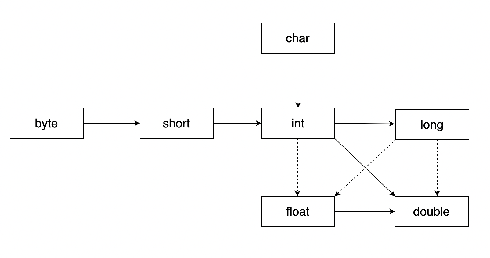

## 10. Type Conversion and Casting

### Implicit Type Casting / Automatic Conversion

- Automatic type conversion takes place if the following conditions are met
    1. The two types are compatible
    2. The destination type is larger than the source type
- it is also known as `widening conversion` .

```markdown
byte c = 5;
int d = c; //  no casting required automatic casting takes place
```



- In above image, the solid line direction implies lossless conversion.
- while dotted line direction implies lossy conversion.
- Reversing the arrow will result in compiler error. which can be forced by Explicit type casting.

### Explicit Type Casting / Narrowing Conversion

```markdown
int z = 90;
// short a = z; // error
short a = (short) z;
```