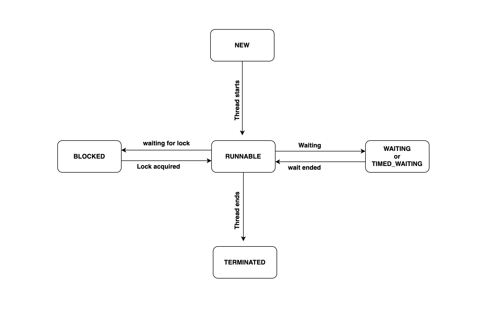

## Thread States

- We can get the state of a thread by calling `getState()` method on them.

- `BLOCKED` : A thread has suspended execution because it is waiting to acquire a lock.
- `NEW`: A thread has not begun execution.
- `RUNNABLE`: A thread that either is currently executing or will execute when it gains access to the CPU.
- `TERMINATED`: A thread that has completed execution.
- `TIMED_WAITING`: A thread that has suspended execution for a specified period of time, such as when it has called sleep(). This state is also entered when a timeout version of wait() or join() is called.
- `WAITING`: A thread that has suspended execution because it is waiting for some action to occur. For example: it is waiting because of a call to a non-timeout version of wait() or join().

